# Client Connectivity: WebSocket and HTTP

This documentation describes the two communication channels for collaboration in Excalidraw and how clients are connected to each other.

## Overview

The Excalidraw app uses **two parallel communication channels**:

1. **WebSocket connection** (Socket.IO) - Real-time synchronization between clients
2. **HTTP REST API** - Persistent storage of scenes and files


## Initialization Phase When Joining a Room

### Normal Flow (Happy Path)

When a client joins an existing room, the following sequence runs:


### Problematic Flow (Backend Offline)

When the HTTP backend is offline, data loss can occur:

```mermaid
sequenceDiagram
    participant ExistingClient as Existing Client
    participant Client as New Client
    participant WS as WebSocket Server<br/>(excalidraw-room)
    participant HTTP as HTTP Storage<br/>(Backend)

    Note over HTTP: ❌ Backend OFFLINE<br/>(Maintenance/Restart)
    
    Client->>WS: 1. connect()
    WS-->>Client: connected
    
    Client->>WS: 2. emit("join-room", roomId)
    WS-->>ExistingClient: 3. emit("new-user", socketId)
    
    Note over ExistingClient: WebSocket also offline<br/>or client doesn't respond
    
    Note over Client: Timeout: no SCENE_INIT<br/>Canvas stays empty<br/>elements = []
    
    Client->>HTTP: 4. GET /rooms/roomId
    Note over HTTP: ❌ Timeout / Error
    HTTP--xClient: Connection refused
    
    Note over HTTP: Backend comes back online
    
    Client->>HTTP: 5. Retry: GET /rooms/roomId
    HTTP-->>Client: 404 Not Found<br/>(DB was cleared)
    
    Note over Client: ⚠️ DANGER:<br/>404 = Room doesn't exist<br/>Create new room!
    
    Client->>HTTP: 6. PUT /rooms/roomId<br/>elements = [] (EMPTY!)<br/>sceneVersion = 0
    HTTP-->>Client: 200 OK
    
    Note over ExistingClient,Client: 💥 DATA LOSS:<br/>Empty room overwrites<br/>existing data!
    
    ExistingClient->>HTTP: 7. GET /rooms/roomId
    HTTP-->>ExistingClient: 200 OK<br/>elements = []
    
    Note over ExistingClient: Loses all data!
```



### Race Condition Details

The problem occurs when:

1. **HTTP Backend unreachable** (during client initialization)
2. **WebSocket sync fails** (other clients unavailable/slow)
3. **Backend returns with empty state** (404 instead of cached data)


## WebSocket Connection (Real-time)

### Purpose and Functionality

**WebSockets** are used for real-time communication between clients:

- **Bidirectional connection**: Each client connects to the room server
- **Room-based**: Clients in the same room receive mutual updates
- **End-to-end encrypted**: All messages are encrypted with the `roomKey`
- **High-frequency**: Updates occur in real-time (e.g., cursor at ~30fps)

### Connection Establishment

```typescript
// 1. Initialize WebSocket connection
const socket = io(WS_SERVER_URL); // http://localhost:5001

// 2. Join room
socket.emit("join-room", roomId);

// 3. Server confirms
socket.on("init-room", () => {
  console.log("Successfully joined room");
});

// 4. New users are notified
socket.on("new-user", (socketId) => {
  console.log(`New user joined: ${socketId}`);
});
```

**Implementation**: `excalidraw-app/collab/Portal.tsx` (Class `Portal`)

### Message Types

There are two categories of WebSocket messages:

#### Volatile Messages (can be lost)

```typescript
socket.emit("server-volatile-broadcast", roomId, encryptedData, iv);
```

Used for **non-critical, high-frequency updates**:
- Cursor position (`MOUSE_LOCATION`) - ~30fps
- Idle status (`IDLE_STATUS`)
- Viewport bounds (`USER_VISIBLE_SCENE_BOUNDS`)

#### Important Messages (guaranteed delivery)

```typescript
socket.emit("server-broadcast", roomId, encryptedData, iv);
```

Used for **critical updates**:
- Scene Init (`SCENE_INIT`) - Complete scene for new participants
- Scene Update (`SCENE_UPDATE`) - Element changes

### Encryption

All WebSocket messages are encrypted before being sent:

```typescript
async _broadcastSocketData(data, volatile = false) {
  // 1. Serialize data to JSON
  const json = JSON.stringify(data);
  const encoded = new TextEncoder().encode(json);
  
  // 2. End-to-end encrypt with roomKey
  const { encryptedBuffer, iv } = await encryptData(this.roomKey, encoded);
  
  // 3. Send via WebSocket
  this.socket.emit(
    volatile ? "server-volatile-broadcast" : "server-broadcast",
    this.roomId,
    encryptedBuffer,
    iv
  );
}
```

**Important**: The `roomKey` never leaves the client and is only contained in the URL fragment (`#key=...`).

### Connection Tests

```javascript
// Browser Console - Test WebSocket connection
const socket = io("http://localhost:5001");

socket.on("connect", () => {
  console.log("✓ Connected:", socket.id);
});

socket.on("connect_error", (error) => {
  console.error("✗ Connection error:", error);
});

socket.emit("join-room", "test-room-id");
```

**Chrome DevTools**:
- Network Tab → Filter: `WS` for WebSocket traffic
- Application Tab → Frames → WebSocket for live messages

## HTTP Connection (Persistence)

### Purpose and Functionality

**HTTP REST API** is used for permanent storage:

- **Persistence**: Scenes remain after browser restart
- **Backup**: Data is secured even during WebSocket failure
- **Conflict resolution**: Server version is reconciled with local version
- **File storage**: Images and other files are stored separately

### REST API Endpoints

```
# Scenes
PUT  /rooms/{roomId}     - Save scene
GET  /rooms/{roomId}     - Load scene

# Files (Images)
PUT  /files/{fileId}     - Upload file
GET  /files/{fileId}     - Download file
```

**Implementation**: `excalidraw-app/data/httpStorage.ts`

### Saving Scene

```typescript
// Scene is saved with version number and encryption
const saveToHttpStorage = async (portal, elements, appState) => {
  const sceneVersion = getSceneVersion(elements); // Sum of all element versions
  
  // 1. Encrypt elements
  const { ciphertext, iv } = await encryptElements(roomKey, elements);
  
  // 2. Create payload: [Version][IV][Ciphertext]
  const payload = buildPayload(sceneVersion, iv, ciphertext);
  
  // 3. HTTP PUT
  await fetch(`${HTTP_STORAGE_BACKEND_URL}/rooms/${roomId}`, {
    method: "PUT",
    body: payload
  });
};
```

**Storage format**:
```
[4 Bytes: Scene Version] [16 Bytes: IV] [N Bytes: Encrypted Elements]
```

### Loading Scene

```typescript
const loadFromHttpStorage = async (roomId, roomKey) => {
  // 1. HTTP GET
  const response = await fetch(`${HTTP_STORAGE_BACKEND_URL}/rooms/${roomId}`);
  const buffer = await response.arrayBuffer();
  
  // 2. Extract version
  const sceneVersion = parseSceneVersion(buffer);
  
  // 3. Decrypt
  const elements = await decryptElements(buffer, roomKey);
  
  return elements;
};
```

### File Upload (Images)

```typescript
// 1. File is compressed and encrypted
const { encryptedBuffer } = await encryptData(roomKey, imageData);

// 2. HTTP PUT
await fetch(`${HTTP_STORAGE_BACKEND_URL}/files/${fileId}`, {
  method: "PUT",
  body: encryptedBuffer
});

// 3. Update element status
element.status = "saved";
```

### HTTP Tests

```bash
# Server reachable?
curl http://localhost:8080/health

# Load room (returns encrypted binary data)
curl http://localhost:8080/rooms/test-room-id

# Room doesn't exist -> 404
curl -I http://localhost:8080/rooms/non-existent
```

:::warning HTTP Backend Failure - Behavior
**Current Protection**: The system detects when the HTTP storage backend is unreachable and prevents accidental overwriting.

**Implementation (2-stage protection):**

**1. Storage is rejected on server error:**
```typescript
// In httpStorage.ts
const getResponse = await fetch(`${HTTP_STORAGE_BACKEND_URL}/rooms/${roomId}`);

// Check: Only 404 is OK, all other errors → Abort
if (!getResponse.ok && getResponse.status !== 404) {
  return false; // ✓ Prevents storage on server error
}

if (getResponse.status === 404) {
  // Only if 404: Room really doesn't exist
  const result = await saveElementsToBackend(roomKey, roomId, [...elements], sceneVersion);
}
```

**2. Autosave is disabled on load error:**
```typescript
// In Collab.tsx - initializeRoom()
try {
  const elements = await storageBackend.loadFromStorageBackend(roomId, roomKey, socket);
  // ...
} catch (error) {
  // ✓ Show UI warning
  const errorMessage = t("errors.cannotResolveCollabServer");
  this.setErrorDialog(errorMessage);
  this.setErrorIndicator(errorMessage);
  
  // ✓ Disable autosave to avoid faulty requests
  this.canPersistToBackend = false;
  this.queueSaveToFirebase.cancel();
  
  // ✓ WebSocket continues - other peers sync the scene
  console.error(error);
}
```

**3. Throttled autosave checks flag:**
```typescript
queueSaveToFirebase = throttle(() => {
  if (this.portal.socketInitialized && this.canPersistToBackend) {
    this.saveCollabRoomToFirebase(/* ... */);
  }
}, SAVE_TO_FIREBASE_TIMEOUT);
```

